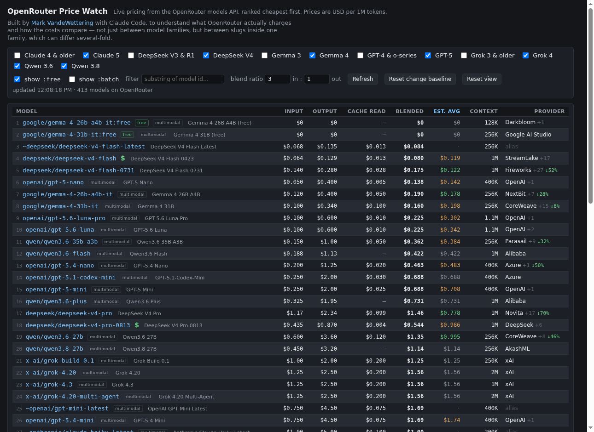

# OpenRouter Price Watch

A single self-contained HTML page that tracks model pricing on
[OpenRouter](https://openrouter.ai) and ranks the models I care about by cost.
No build step, no dependencies, no API key — open `index.html` in a browser.

**Live: <https://mvandewettering.com/openrouter-recommendations/>**



## What it does

- Pulls the public `/api/v1/models` endpoint on load and every 15 minutes.
- Filters to a set of model families — DeepSeek V4, Qwen 3.6/3.8, Gemma 4,
  Grok 4, GPT-5, Claude — each a checkbox, with older generations available
  behind their own toggles.
- Ranks by **blended** cost: the price of 1M tokens at your prompt/completion
  mix (default 3:1), since output tokens usually dominate a real bill.
- Estimates the **average** cost per request across a model's providers, and
  names the provider serving OpenRouter's default route.
- Flags price changes since the last time you looked.

## Columns

| Column | Meaning |
| --- | --- |
| Model | The API slug, with the human-readable name trailing it |
| Input / Output | Price per 1M tokens on the default route |
| Cache read | Price per 1M cached input tokens |
| Blended | `(in×input + out×output) / (in+out)` at your ratio |
| Est. avg | Expected cost across all providers (see below) |
| Context | Context window |
| Provider | Who serves the default route, `+n` others, `↓n%` if one is cheaper |

## Estimating the average cost

A slug is not one product: `deepseek/deepseek-v4-pro` is served by ~18
providers at prices spanning 5×, and you are billed at the rate of whichever
one handles your request. OpenRouter load-balances with inverse-square
weighting on price and skips providers that are down, so the expected cost is

```
w_i ∝ u_i / p_i²   ⇒   E[p] = Σ(u_i/p_i) / Σ(u_i/p_i²)
```

where `p_i` is a provider's blended price and `u_i` its 30-minute uptime.
Deranked endpoints (negative `status`) and opt-in tiers (`flex`, `priority`,
`batch`, `zdr`) are excluded, since default traffic never lands on them.

Treat it as an estimate: the exponent is the documented behaviour rather than a
published constant, and your own provider preferences override the routing
entirely. Use `sort: "price"` with `allow_fallbacks: false` if you want a
deterministic rate.

## Notes

- **Grouping.** Sorting by Model nests each release line (`openai/gpt-5`) over
  its variant families (`…-v4-flash` and its dated builds), cheapest first
  inside each. Headers are collapsible.
- **Tiers.** `:free` and `:batch` variants are separate service tiers, not
  cheaper releases, so they are toggled separately and excluded from the
  cheapest-version badge.
- **State.** Filters, blend ratio, sort order and collapsed groups persist in
  `localStorage`, along with a price baseline used for the change arrows.
  *Reset view* clears the UI state; *Reset change baseline* re-anchors prices.

## Hosting

Served by GitHub Pages from `main` at the repository root — there is nothing to
build, so a push to `main` is a deploy. The page only ever talks to
`openrouter.ai`, which sends permissive CORS headers, so it works the same from
a static host as it does from `file://`... except that `file://` pages have a
null origin, which the API can reject. Serve it over HTTP when testing locally:

```sh
python3 -m http.server 8731    # then open http://localhost:8731/
```

## Editing the watchlist

The families live in the `FAMILIES` array at the top of the `<script>` block.
Each entry is a label plus a regex tested against the model id:

```js
{ key: 'grok4', label: 'Grok 4', on: true,
  test: id => /^~?x-ai\/grok-(4|latest|build)/.test(id) },
```
